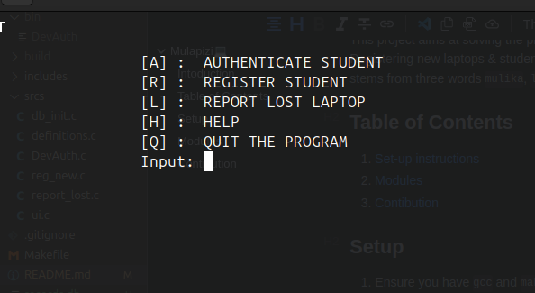

<<<<<<< HEAD
## <ins>Soving Rising🚀 Laptops ***Theft*** Cases on Institutions</ins></br>
### Modules lists</br>
- Registration module</br>
- Database module</br>
- Load module</br>
     -To load data from database to the main memory</br>
-  Flag module</br>
- Main program module</br>
- Header files and variables</br>
### Contibution</br>
> [!IMPORTANT]
> All pull-requests are welcomed 
=======
# Mulapizi💻

## Intoduction

This project aims at solving the problem of Laptop theft in Universities. The software built on C is a command-line tool for Registering new laptops & students and ensuring that there is no mismatch in the Laptop ownership. The name `Mulapizi` stems from three words `mulika`, `laptop` and `wizi` all truncated at different points to make a creative feel of the software.

## Table of Contents

1. [Set-up instructions](#setup)
2. [Basic Functionalities](#functionalities)
2. [Modules](#modules)
3. [Contibution](#contibution)

## Setup

1. Ensure you have `gcc` and `make` installed in your environment
     ```bash
     sudo apt-get install -y gcc make
     ```
2. Install the `SQLite Header` for C
     ```bash
     sudo apt-get install  -y libsqlite3-dev
     ```
3. Clone the repository(Get the link from the GitHub repo)
4. `cd` into `Laptop_Registration_Project` and `make` the files.
     ```bash
     cd Laptop_Registration_Project && make
     ```
5. Test the compiled application found in the `bin` directory
     ```bash
     ./bin/DevAuth
     ```
6. Should see an interface that looks like the one below:


## Functionalities

1. `Registration ('R')`: Register new student and their laptop
2. `Authentication ('A')`: Prompts the user to enter student's registration and displays their data if found.
3. `Help ('H')`: Shows information for using the application
4. `Quit ('Q')`: quits the application by deleting the created window.

## Modules

- Registration module
- Database module
- Load module
  -To load data from database to the main memory
- Flag module
- Main program module
- Header files and variables

## Contibution

- To contibute to this repository:

1. Fork the repository
2. Make changes where necessary
3. Create pull request on GitHub by opening an issue on the issue page afer creating a PR
4. Ensure you highlight the changes made and the best practices employed while writing the changes.
5. Adhere to standard documentation of code for easy collaboration.
6. Tag the repo owners.

**NOTE** If Changes affect the basic functionalities of the application, update the necessary documentation at the [Basic Functionalities](#functionalities) section.

> [!IMPORTANT]
> All pull-requests are welcomed
>>>>>>> 4cff159 (Add Dockerfile, README, and UI assets for Laptop Registration Project)
